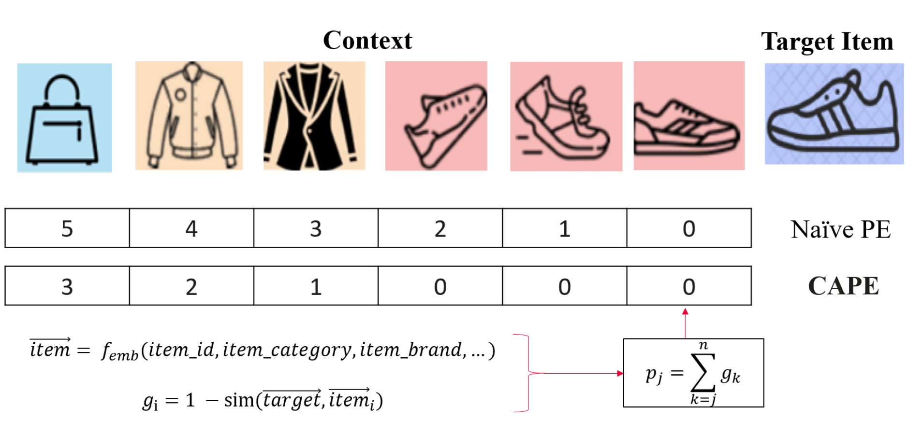

# CAPE
source code of paper "A Contextual-Aware Position Encoding for Sequential Recommendation", WWW'25

<div align="left">

[](https://arxiv.org/pdf/2502.09027)
<a href="https://github.com/reczoo/FuxiCTR/blob/main/LICENSE"></a>
<a href="https://pypi.org/project/fuxictr"></a>
<a href="https://pypi.org/project/fuxictr"></a>
</div>

<p align="center"> 
    
</p>

**The code in this repository is currently under development**

## Quick Start
1. Run a model on benchmark datasets (e.g., KuaiVideo)

   Users can follow the [benchmark section](#Benchmarking) to get benchmark datasets and running steps for reproducing the existing results. Please see an example here: https://github.com/reczoo/BARS/tree/main/ranking/ctr/DCNv2/DCNv2_criteo_x1

2. Tune hyper-parameters of a model
    
   ```
   cd experiment
   python run_param_tuner.py --config config/DIN_amazonelectronics_x1_tuner_config.yaml --gpu 0 
   ```
   You can set hyper-parameter *use_cope* to True to use CAPE in the model.

## Experimental Result
   
## Citation

If our work has been of assistance to your work, feel free to give us a star ⭐ or cite us using :  

```
@article{yuan2025CAPE,
      title={A Contextual-Aware Position Encoding for Sequential Recommendation}, 
      author={Jun Yuan and Guohao Cai and Zhenhua Dong},
      journal={arXiv preprint arXiv:2502.09027},
      year={2025},
      eprint={2502.09027},
      archivePrefix={arXiv}
}
```

## Aknowledgement
> Thanks to the excellent code repository [FuxiCTR](https://github.com/reczoo/FuxiCTR) 
> CAPE is released under the Apache-2.0 license, some codes are modified from FuxiCTR, which are released under the Apache-2.0 license.
